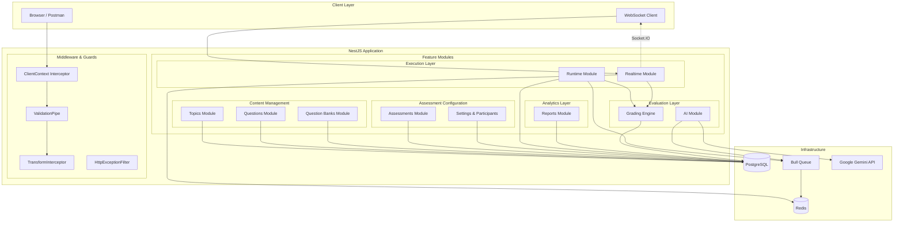
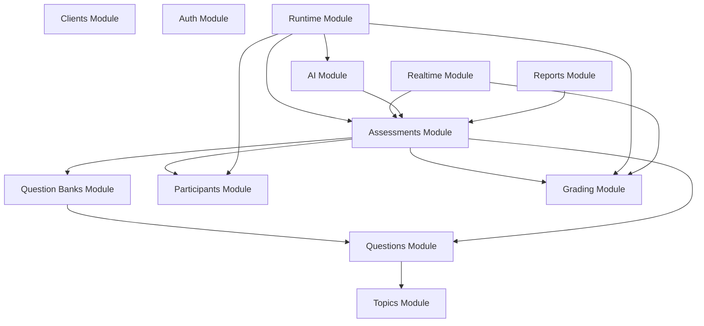
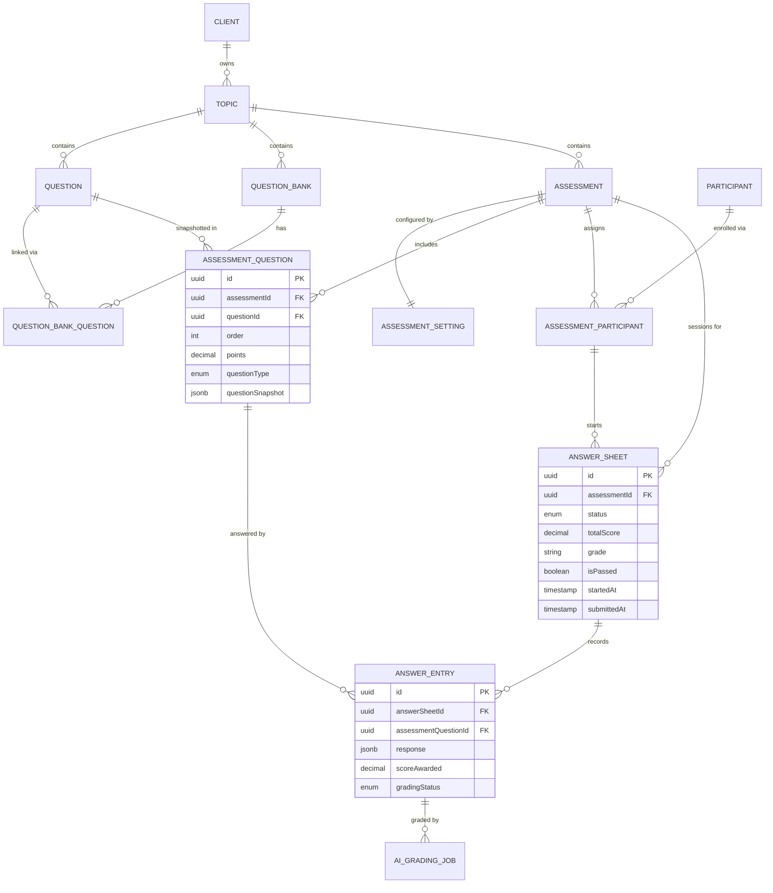
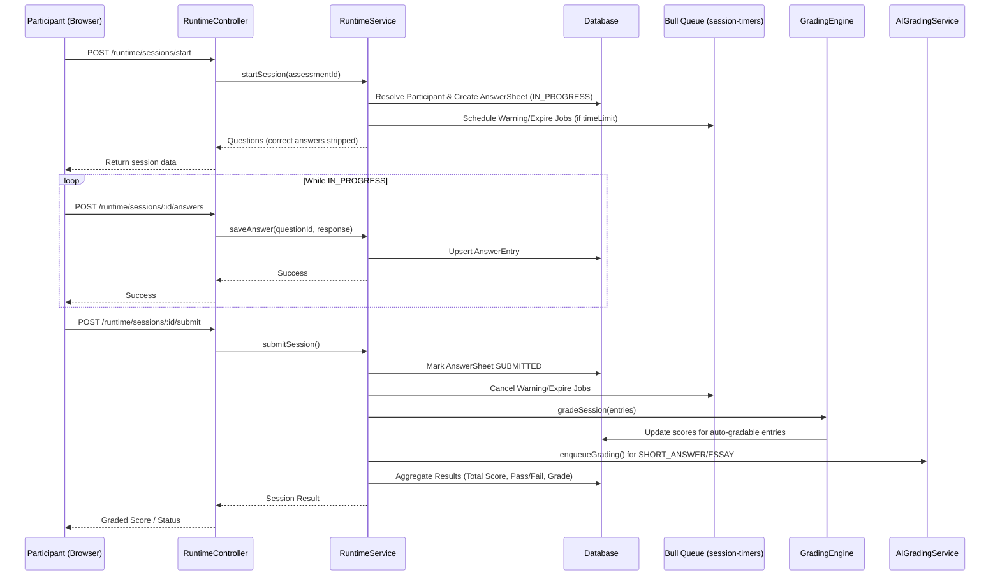
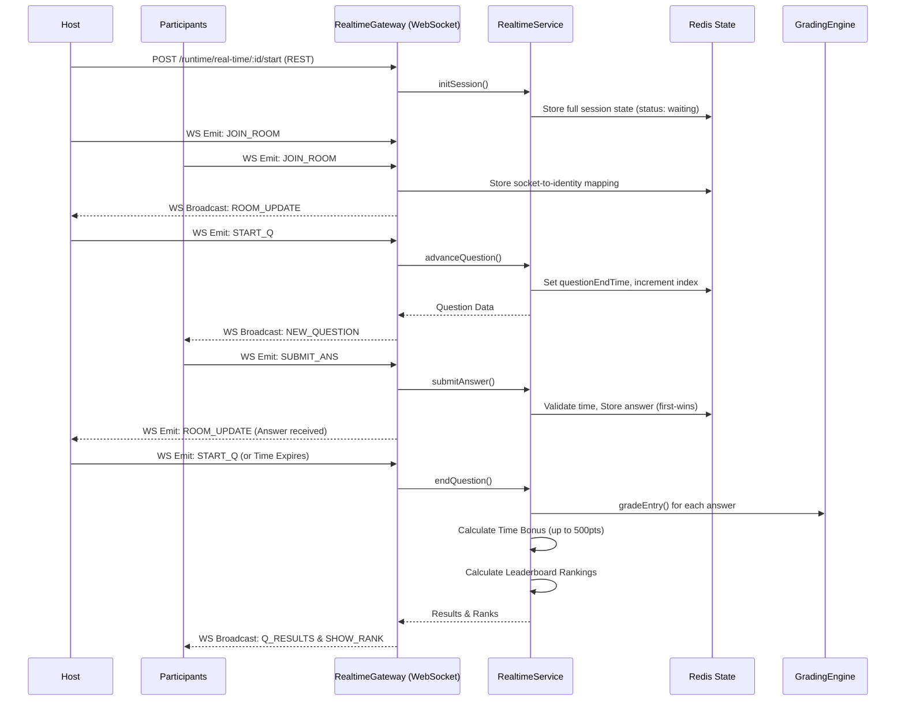
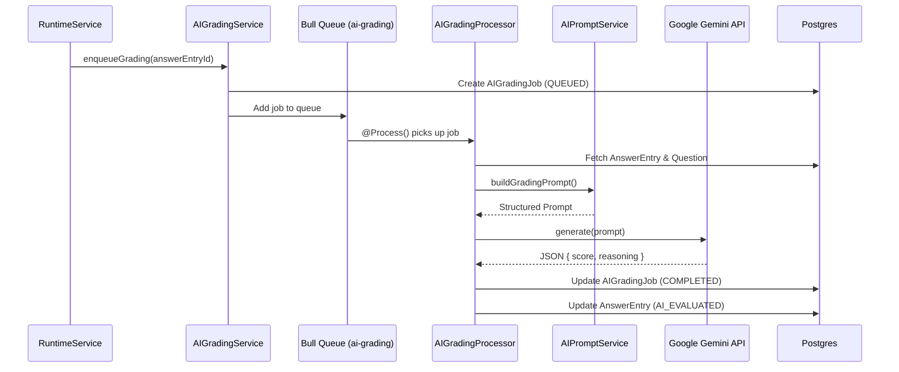
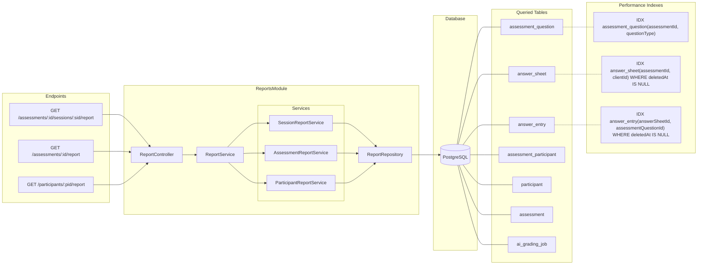
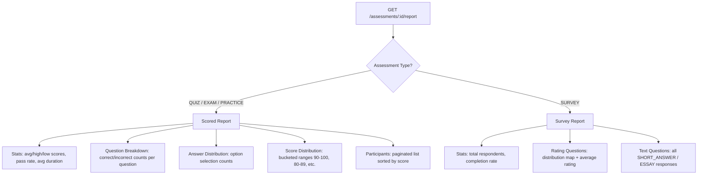

# Assessment Service Backend System Documentation

This document describes the core features of the Assessment Service Backend and details how they work, from question creation to runtime execution and auto-grading.

---

## 1. System Overview

The Assessment Service Backend is a NestJS application designed to create, configure, distribute, and grade educational and certification assessments. It handles multi-tenant clients, question banking, flexible settings, and runtime assessment sessions (both self-paced and instructor-led real-time modes) using a Postgres database for configuration, a Redis/Bull queue for session timing, and Socket.IO WebSockets for live session sync.

This diagram illustrates the high-level architecture of the Assessment Service. It showcases how the NestJS backend connects to various infrastructure components (PostgreSQL, Redis, Bull Queue, Google Gemini API). The system is layered into Middleware (handling tenant contexts), Content Management, Assessment Configuration, Execution, Analytics, and Evaluation layers. Clients can interact via REST endpoints or WebSockets for real-time features.



### 1.1. Module Dependencies

A top-down view of how the various NestJS feature modules depend on one another. The `AssessmentsModule` acts as a central hub, orchestrating Content (Questions/Banks) and Configurations. The Execution modules (`Runtime` and `Realtime`) sit on top, consuming Assessments, Participants, and invoking the `Grading` and `AI` modules upon session completion.



### 1.2. Entity Relationship Diagram

This ERD maps the core database schema in PostgreSQL. It shows how multi-tenant Clients own Topics, which in turn contain Questions, Banks, and Assessments. It traces the lifecycle from assessment configuration (AssessmentSettings) to participant enrollment (AssessmentParticipant), and finally to runtime execution via AnswerSheets and AnswerEntries, which link directly back to snapshotted AssessmentQuestions.



---

## 2. Core Feature Modules

### 2.1. Topics Module

Topics serve as the root organizational unit for questions and assessments (e.g., "TypeScript & NestJS").

- **Key Behavior**: Every question and assessment must be linked to a parent topic. Question banks also belong to a topic.

### 2.2. Questions Module

Supports a rich set of 9 distinct question types designed for automated or manual evaluation.

- **Question Types**:
  1. `SINGLE_CHOICE`: Single option selection.
  2. `MULTIPLE_CHOICE`: Multiple option selection.
  3. `TRUE_FALSE`: Binary boolean statement.
  4. `ORDERING`: Ordering a list of options sequentially.
  5. `FILL_IN_THE_BLANK`: Text completion with variation support per blank.
  6. `MATCHING`: Pairing items on the left side with items on the right side.
  7. `RATING`: Completion/survey rating scales.
  8. `SHORT_ANSWER`: Subjective short text (requires manual review).
  9. `ESSAY`: Subjective long text (requires manual review).
- **Storage**: Options and correct answer formulas are stored dynamically inside TypeORM `jsonb` columns (`options` and `correctAnswer`) to prevent database schema explosion.

### 2.3. Question Banks Module

Reusable repositories of questions that can be categorized, searched, and pulled into assessments.

- **Visibility**: Question banks can be marked `PUBLIC` (shared across the client tenant) or `PRIVATE` (restricted creator access).
- **Tags**: Used for searching and grouping (e.g. `['typescript', 'junior']`).

### 2.4. Assessments Module

Defines the parameters, rules, and configurations for test sessions.

- **Lifecycle**: `DRAFT` ➔ `PUBLISHED` ➔ `ARCHIVED`.
  - _Draft_: Questions, settings, and join configurations can be updated freely.
  - _Published_: Content is frozen. A complete snapshot of all questions (`questionSnapshot`) is saved onto the junction table (`AssessmentQuestion`) so that edits to the live question records do not break active sessions.
  - _Archived_: No new sessions can start; historical records are preserved.
- **Key Configuration Settings**:
  - **Question Selection**:
    - `MANUAL`: Specific questions are explicitly linked to the assessment with custom weights (points).
    - `DYNAMIC`: Questions are randomly pulled from a bank or topic at session start based on distribution rules (e.g., "5 Easy, 3 Medium, 2 Hard").
  - **Participant Identity**:
    - `ANONYMOUS`: Anyone can join without credentials. A participant record is generated on the fly.
    - `AUTHENTICATED` / `EXTERNAL`: Participants join via a link. If they exist, they start immediately; if not, they are linked dynamically upon starting.
  - **Timing**: Optional `timeLimit` in minutes.
  - **Evaluation**: Configurable passing percentage (`passMark`) and grade thresholds (`gradeLabels` e.g., `A: >=80%`, `B: >=60%`).

---

## 3. Runtime Layer (Self-Paced Mode)

The Runtime layer manages the live participant experience during an assessment.

This sequence diagram outlines a standard, self-paced assessment attempt. Participants start a session, receiving stripped questions while background timers are scheduled in Bull Queue if a time limit exists. Answers are incrementally saved. Upon submission (manual or auto-expired), the `GradingEngine` calculates deterministic scores, while subjective answers are routed to the AI Queue.



### 3.1. Session Expiry Mechanics

If an assessment has a `timeLimit` configured, starting a session registers two jobs in the Redis-backed Bull Queue:

1. **`warning`**: Fires 5 minutes before expiration to alert the client UI.
2. **`expire`**: Fires at the exact expiration limit. It automatically closes the session, packages all saved answers, and submits the session on behalf of the participant.

---

## 4. Real-Time Layer (Instructor-Led Mode)

The Real-Time layer handles live, synchronized assessment sessions where a host (instructor) controls the flow of questions.

Instructor-led sessions rely heavily on WebSockets (`Socket.IO`) and Redis. The host controls the pace, broadcasting questions to all connected participants simultaneously. Participant answers are captured in Redis using a first-answer-wins mechanism. When the host ends the question, the system instantly grades all answers, applies a time-bonus scaling score, and broadcasts live leaderboard updates.



### 4.1. Resilience and Disconnections

The platform supports connection resilience. A participant's socket ID is tracked against their identity in the Redis Hash. If a participant drops connection and rejoins during an active question, the Gateway instantly retrieves the `questionEndTime` from Redis and re-emits a targeted `NEW_QUESTION` event so they can seamlessly continue without waiting for the next question.

### 4.2. Instant Auto-Grading & Time Bonus

During Real-Time sessions, answers are evaluated instantly at the end of each question using the same Grading Engine strategies (`SINGLE_CHOICE`, `MULTIPLE_CHOICE`, `TRUE_FALSE`, `ORDERING`, `MATCHING`).
A unique `timeTaken` parameter allows the system to award a dynamic **Time Bonus** scaling up to 500 extra points for fast responses, which applies directly to the live leaderboard.

---

## 5. The Grading Engine

When a session is submitted (manually or automatically via expiry), the grading engine processes the entries and updates the overall session results.

### 5.1. Question Evaluation Strategies

| Question Type           | Correct Answer Schema              | Evaluation Strategy                                                                                                                        |
| :---------------------- | :--------------------------------- | :----------------------------------------------------------------------------------------------------------------------------------------- |
| **`SINGLE_CHOICE`**     | `{ optionId: string }`             | Matches `response.optionId === correctAnswer.optionId` (binary score).                                                                     |
| **`MULTIPLE_CHOICE`**   | `{ optionIds: string[] }`          | Matches exact set of checked options (order-independent).                                                                                  |
| **`TRUE_FALSE`**        | `{ value: boolean }`               | Matches exact boolean values.                                                                                                              |
| **`ORDERING`**          | `{ sequence: string[] }`           | Matches exact array order index-by-index.                                                                                                  |
| **`FILL_IN_THE_BLANK`** | `{ answers: string[][] }`          | Supports variations. Compares each index (case-insensitive, trimmed). **Supports partial credit** `(correctCount / totalBlanks) * points`. |
| **`MATCHING`**          | `{ pairs: { leftId, rightId }[] }` | Checks matching pairs. **Supports partial credit** `(correctPairsCount / totalPairs) * points`.                                            |
| **`RATING`**            | None (Survey)                      | Awarded full points as long as a value is chosen.                                                                                          |
| **`SHORT_ANSWER`**      | `{ keyPointsExpected: string[] }`  | Evaluated by Gemini AI worker asynchronously (returns score/reasoning) unless manual grading override is set.                              |
| **`ESSAY`**             | `{ keyPointsExpected: string[] }`  | Evaluated by Gemini AI worker asynchronously (returns score/reasoning) unless manual grading override is set.                              |

### 5.2. AI-Assisted and Manual-only Evaluation

The platform supports two evaluation paths for subjective questions (`SHORT_ANSWER` and `ESSAY`):

1. **Asynchronous AI-Assisted Grading**:
   - By default, submitting an assessment session queues a background grading job on the `'ai-grading'` Bull queue.
   - The queue processor runs within the corresponding tenant client context, fetches the entry response, and calls the Google Gemini API (model `gemini-2.5-flash`).
   - The AI evaluates the answer against the criteria and key points, returns a JSON object containing a `score` and `reasoning`, updates the entry status to `AI_EVALUATED`, and triggers session score recalculation.

2. **Manual-only Grading Override**:
   - If the assessment setting `manualGradingAIQues` is set to `true`, the background AI queue is bypassed.
   - The subjective answer entry's status is set directly to `PENDING` (awaiting human grader review).

3. **Recalculation**:
   - Graders can submit updates to the subjective scores in the database.
   - Calling the public endpoint `POST /api/v1/assessments/:sessionId/recalculate` recalculates the total scores, applies passing score evaluations, computes grade labels, and updates the answer sheet status to `GRADED`.

#### 5.2.1. AI Background Grading Flow

Subjective questions (`SHORT_ANSWER` and `ESSAY`) require asynchronous evaluation to prevent blocking HTTP requests. Upon session submission, entries are placed into a Redis-backed Bull Queue. A background processor constructs a highly structured prompt (including the student's answer, expected key points, and constraints), sends it to the Google Gemini API, and parses the JSON response to update the database with a score and reasoning.



### 5.3. Session Aggregation Formulas

Once all individual answer entries have been graded, the grading engine performs the following calculations:

1. **Total Score**: Sums up the scored points from all entries:
   $$\text{totalScore} = \sum \text{scoreAwarded}$$
2. **Pass Evaluation**: Evaluates if the participant met the minimum threshold:
   $$\text{percentage} = \left( \frac{\text{totalScore}}{\text{maxPossibleScore}} \right) \times 100$$
   $$\text{isPassed} = \text{percentage} \ge \text{passMark}$$
3. **Grade Label Assignment**: Compares the percentage score against the configured `gradeLabels` sorted in descending order, assigning the matching letter grade.
4. **Final Session Status**:
   - If any answer entry is marked `GradingStatus.PENDING` (due to `SHORT_ANSWER` or `ESSAY` questions):
     - Session status ➔ **`REQUIRES_REVIEW`**
   - Otherwise:
     - Session status ➔ **`GRADED`**

---

## 6. Reports & Analytics Module

The Reports module provides read-only, aggregated analytics views across three axes: individual sessions, full assessments, and participant histories. It is type-aware — automatically switching between scored report layouts and survey report layouts based on the assessment's `type`.

### 6.1. Report Types

| Report | Endpoint | Description |
| :--- | :--- | :--- |
| **Session Report** | `GET /assessments/:assessmentId/sessions/:sessionId/report` | Deep dive into a single participant's attempt. Returns per-question detail (correctness, score awarded, correct answer, options), AI grading notes (key points addressed/missed, confidence, flagForReview), and human override data. |
| **Assessment Report** | `GET /assessments/:assessmentId/report?page=1&limit=20` | Aggregate report for all participants. For **scored** assessments: stats (average/highest/lowest scores, pass rate, avg duration), per-question breakdown (correct/incorrect counts, answer distribution), score distribution buckets (90-100, 80-89, etc.), and paginated participant list. For **surveys**: rating distributions per question, average ratings, and open text responses. |
| **Participant Report** | `GET /participants/:participantId/report` | Cross-assessment transcript. Shows all assessments a participant has taken, scores, grades, pass/fail status, and durations. |

### 6.2. Architecture

The Reports Module follows a facade pattern. The `ReportController` delegates to the `ReportService`, which acts as a facade routing to specialized services for sessions, assessments, or participants. The underlying `ReportRepository` executes highly optimized raw SQL queries leveraging composite indexes to prevent performance bottlenecks on large datasets.



- **ReportController**: Registers the three GET endpoints.
- **ReportService**: Facade that delegates to the specialized services.
- **SessionReportService**: Builds the session report from the `AnswerSheet` entity graph (entries → assessment questions → AI grading jobs → participant).
- **AssessmentReportService**: Routes between scored and survey report generation. Executes raw SQL aggregations via `ReportRepository`.
- **ParticipantReportService**: Compiles cross-assessment participant history.
- **ReportRepository**: Contains raw SQL queries using TypeORM `DataSource` for high-performance aggregate analytics. All queries enforce multi-tenant client isolation.

### 6.3. Database Performance Optimizations

To prevent query degradation as data scales, the following optimizations are applied:

1. **Column Promotion**: The question `type` field is promoted from the JSONB `questionSnapshot` blob onto a first-class `questionType` enum column on `AssessmentQuestion`. This allows PostgreSQL to use standard B-Tree indexes instead of parsing JSON on every row.
2. **Composite Indexes**:
   - `assessment_question(assessmentId, questionType)` — speeds up survey type filtering.
   - `answer_sheet(assessmentId, clientId) WHERE deletedAt IS NULL` — speeds up per-assessment participant lookups.
   - `answer_entry(answerSheetId, assessmentQuestionId) WHERE deletedAt IS NULL` — speeds up per-session answer lookups.
3. **Backfill Migration**: Existing records are backfilled via:
   ```sql
   UPDATE assessment_question
   SET "questionType" = ("questionSnapshot"->>'type')::"public"."assessment_question_questiontype_enum"
   WHERE "questionSnapshot" IS NOT NULL AND "questionSnapshot"->>'type' IS NOT NULL;
   ```

### 6.4. Assessment Report Routing Logic

Depending on the Assessment `type`, the Reports module dynamically alters its output format. Scored assessments (Quiz, Exam, Practice) return pass rates, score distributions, and exact correctness breakdowns. Survey assessments bypass scoring logic entirely, instead returning rating distributions and raw textual responses.


