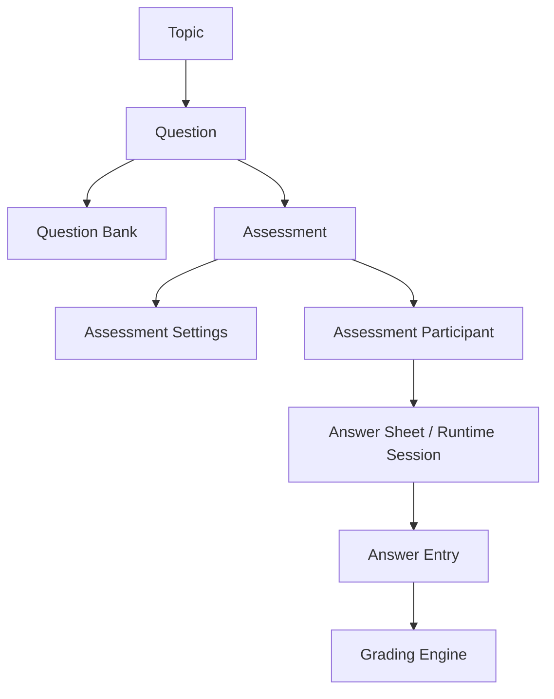
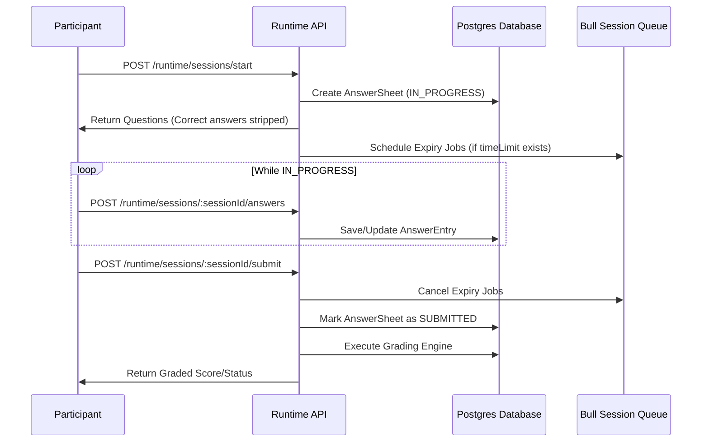

# Assessment Service Backend System Documentation

This document describes the core features of the Assessment Service Backend and details how they work, from question creation to runtime execution and auto-grading.

---

## 1. System Overview

The Assessment Service Backend is a NestJS application designed to create, configure, distribute, and grade educational and certification assessments. It handles multi-tenant clients, question banking, flexible settings, and runtime assessment sessions (self-paced mode) using a Postgres database for configuration and a Redis/Bull queue for session timing.

---

## 2. Core Feature Modules

### 2.1. Topics Module
Topics serve as the root organizational unit for questions and assessments (e.g., "TypeScript & NestJS").
* **Key Behavior**: Every question and assessment must be linked to a parent topic. Question banks also belong to a topic.

### 2.2. Questions Module
Supports a rich set of 9 distinct question types designed for automated or manual evaluation.
* **Question Types**:
  1. `SINGLE_CHOICE`: Single option selection.
  2. `MULTIPLE_CHOICE`: Multiple option selection.
  3. `TRUE_FALSE`: Binary boolean statement.
  4. `ORDERING`: Ordering a list of options sequentially.
  5. `FILL_IN_THE_BLANK`: Text completion with variation support per blank.
  6. `MATCHING`: Pairing items on the left side with items on the right side.
  7. `RATING`: Completion/survey rating scales.
  8. `SHORT_ANSWER`: Subjective short text (requires manual review).
  9. `ESSAY`: Subjective long text (requires manual review).
* **Storage**: Options and correct answer formulas are stored dynamically inside TypeORM `jsonb` columns (`options` and `correctAnswer`) to prevent database schema explosion.

### 2.3. Question Banks Module
Reusable repositories of questions that can be categorized, searched, and pulled into assessments.
* **Visibility**: Question banks can be marked `PUBLIC` (shared across the client tenant) or `PRIVATE` (restricted creator access).
* **Tags**: Used for searching and grouping (e.g. `['typescript', 'junior']`).

### 2.4. Assessments Module
Defines the parameters, rules, and configurations for test sessions.
* **Lifecycle**: `DRAFT` ➔ `PUBLISHED` ➔ `ARCHIVED`.
  * *Draft*: Questions, settings, and join configurations can be updated freely.
  * *Published*: Content is frozen. A complete snapshot of all questions (`questionSnapshot`) is saved onto the junction table (`AssessmentQuestion`) so that edits to the live question records do not break active sessions.
  * *Archived*: No new sessions can start; historical records are preserved.
* **Key Configuration Settings**:
  * **Question Selection**:
    * `MANUAL`: Specific questions are explicitly linked to the assessment with custom weights (points).
    * `DYNAMIC`: Questions are randomly pulled from a bank or topic at session start based on distribution rules (e.g., "5 Easy, 3 Medium, 2 Hard").
  * **Participant Identity**:
    * `ANONYMOUS`: Anyone can join without credentials. A participant record is generated on the fly.
    * `AUTHENTICATED` / `EXTERNAL`: Participants join via a link. If they exist, they start immediately; if not, they are linked dynamically upon starting.
  * **Timing**: Optional `timeLimit` in minutes.
  * **Evaluation**: Configurable passing percentage (`passMark`) and grade thresholds (`gradeLabels` e.g., `A: >=80%`, `B: >=60%`).

---

## 3. Runtime Layer (Self-Paced Mode)

The Runtime layer manages the live participant experience during an assessment.

### 3.1. Session Expiry Mechanics
If an assessment has a `timeLimit` configured, starting a session registers two jobs in the Redis-backed Bull Queue:
1. **`warning`**: Fires 5 minutes before expiration to alert the client UI.
2. **`expire`**: Fires at the exact expiration limit. It automatically closes the session, packages all saved answers, and submits the session on behalf of the participant.

---

## 4. The Grading Engine

When a session is submitted (manually or automatically via expiry), the grading engine processes the entries and updates the overall session results.

### 4.1. Question Evaluation Strategies

| Question Type | Correct Answer Schema | Evaluation Strategy |
| :--- | :--- | :--- |
| **`SINGLE_CHOICE`** | `{ optionId: string }` | Matches `response.optionId === correctAnswer.optionId` (binary score). |
| **`MULTIPLE_CHOICE`** | `{ optionIds: string[] }` | Matches exact set of checked options (order-independent). |
| **`TRUE_FALSE`** | `{ value: boolean }` | Matches exact boolean values. |
| **`ORDERING`** | `{ sequence: string[] }` | Matches exact array order index-by-index. |
| **`FILL_IN_THE_BLANK`**| `{ answers: string[][] }` | Supports variations. Compares each index (case-insensitive, trimmed). **Supports partial credit** `(correctCount / totalBlanks) * points`. |
| **`MATCHING`** | `{ pairs: { leftId, rightId }[] }` | Checks matching pairs. **Supports partial credit** `(correctPairsCount / totalPairs) * points`. |
| **`RATING`** | None (Survey) | Awarded full points as long as a value is chosen. |
| **`SHORT_ANSWER`** | `{ keyPointsExpected: string[] }` | Evaluated by Gemini AI worker asynchronously (returns score/reasoning) unless manual grading override is set. |
| **`ESSAY`** | `{ keyPointsExpected: string[] }` | Evaluated by Gemini AI worker asynchronously (returns score/reasoning) unless manual grading override is set. |

### 4.2. AI-Assisted and Manual-only Evaluation

The platform supports two evaluation paths for subjective questions (`SHORT_ANSWER` and `ESSAY`):

1. **Asynchronous AI-Assisted Grading**:
   - By default, submitting an assessment session queues a background grading job on the `'ai-grading'` Bull queue.
   - The queue processor runs within the corresponding tenant client context, fetches the entry response, and calls the Google Gemini API (model `gemini-2.5-flash`).
   - The AI evaluates the answer against the criteria and key points, returns a JSON object containing a `score` and `reasoning`, updates the entry status to `AI_EVALUATED`, and triggers session score recalculation.

2. **Manual-only Grading Override**:
   - If the assessment setting `manualGradingAIQues` is set to `true`, the background AI queue is bypassed.
   - The subjective answer entry's status is set directly to `PENDING` (awaiting human grader review).

3. **Recalculation**:
   - Graders can submit updates to the subjective scores in the database.
   - Calling the public endpoint `POST /api/v1/assessments/:sessionId/recalculate` recalculates the total scores, applies passing score evaluations, computes grade labels, and updates the answer sheet status to `GRADED`.

### 4.3. Session Aggregation Formulas
Once all individual answer entries have been graded, the grading engine performs the following calculations:

1. **Total Score**: Sums up the scored points from all entries:
   $$\text{totalScore} = \sum \text{scoreAwarded}$$
2. **Pass Evaluation**: Evaluates if the participant met the minimum threshold:
   $$\text{percentage} = \left( \frac{\text{totalScore}}{\text{maxPossibleScore}} \right) \times 100$$
   $$\text{isPassed} = \text{percentage} \ge \text{passMark}$$
3. **Grade Label Assignment**: Compares the percentage score against the configured `gradeLabels` sorted in descending order, assigning the matching letter grade.
4. **Final Session Status**:
   * If any answer entry is marked `GradingStatus.PENDING` (due to `SHORT_ANSWER` or `ESSAY` questions):
     * Session status ➔ **`REQUIRES_REVIEW`**
   * Otherwise:
     * Session status ➔ **`GRADED`**

